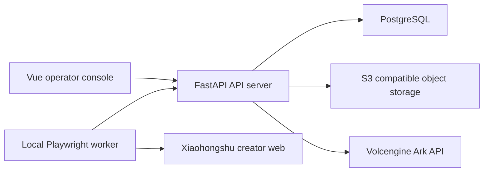

# Architecture

Red Book Agent is split into a stateless API server and one or more stateful publishing workers.

## Agent Runtime

The API uses `packages/agent_core` instead of an open-source Agent framework. Each step records:

- thought summary
- action name
- action input
- observation
- status and error

The UI only displays concise thought summaries and tool observations.

## Publishing Boundary

The worker uses persistent Chromium profiles per Xiaohongshu account. If login, CAPTCHA, or platform risk-control appears, the job is moved to `requires_human_intervention`.

## Current Implementation Notes

- `ALLOW_MOCK_MODELS=true` lets the full draft flow run without API keys.
- Remote browser control has the API and worker protocol shape in place; production-grade streaming can be extended from the existing WebSocket endpoints.
- Local development creates database tables automatically on API startup. The SQL migration exists for controlled environments.

